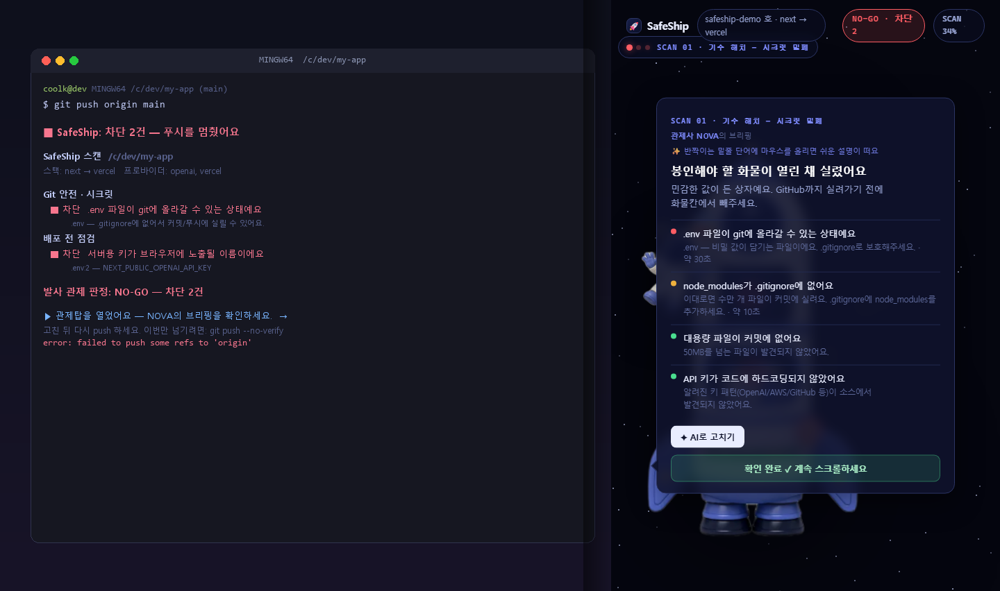
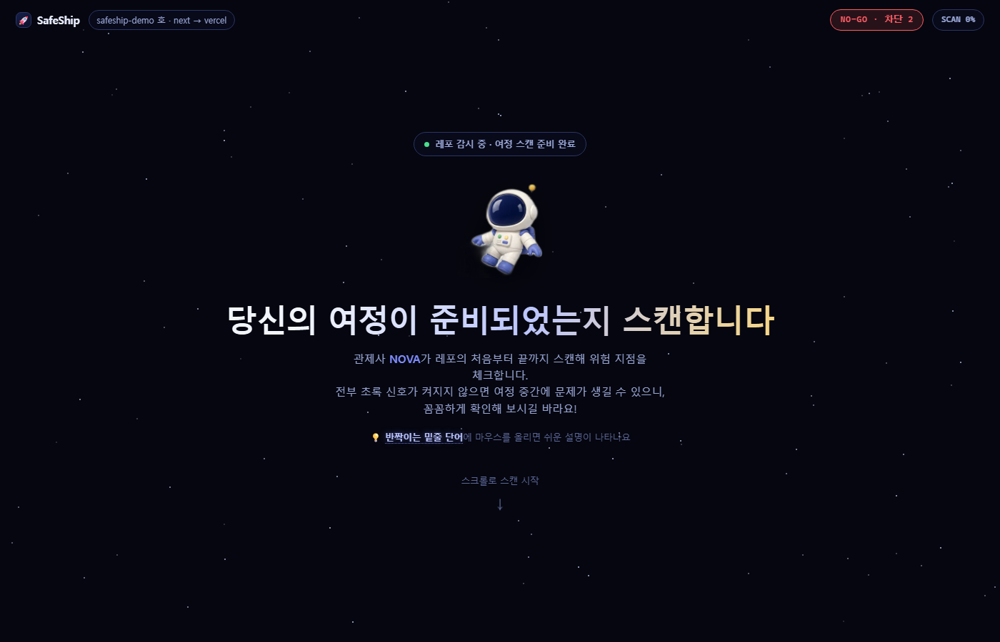
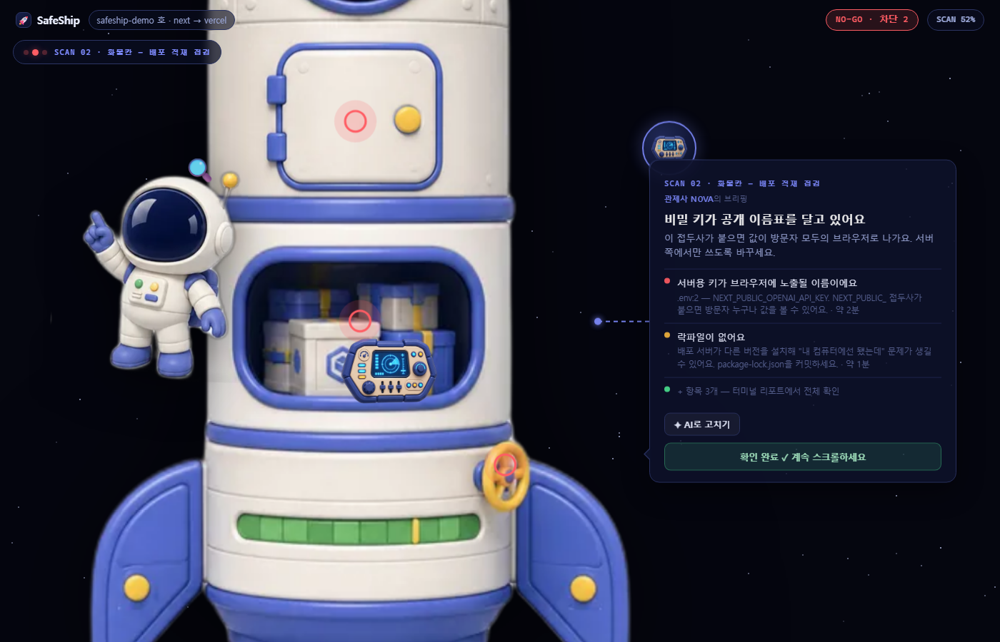
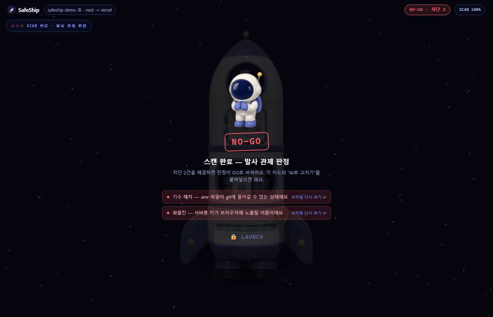
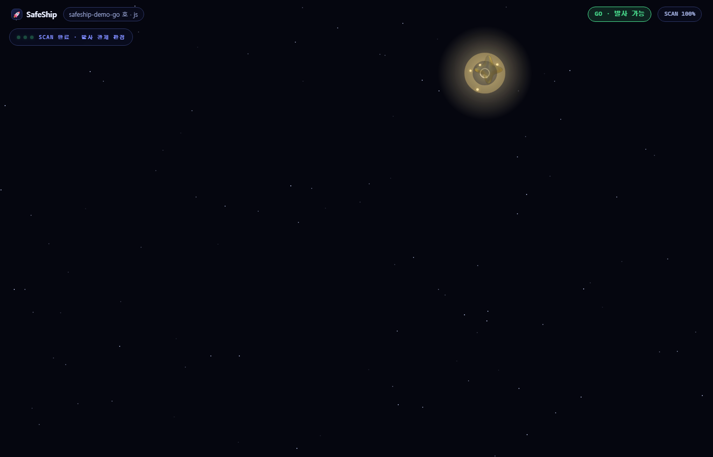

# 🚀 SafeShip

**바이브코더를 위한 배포 안전벨트.** `git push` 직전에 위험한 Git 동작·시크릿 유출·배포 실패·요금 폭주를 자동으로 잡아, "자고 일어나니 200만원" 같은 사고를 막아줍니다.

관제사 **NOVA**가 당신의 레포를 처음부터 끝까지 스캔해서, 전부 초록 신호(GO)일 때만 발사(push)를 허락해요.



---

## 무엇을 잡아주나 (3기둥)

| 기둥 | 예시 |
|---|---|
| **Git 안전 · 시크릿** | `.env`·개인키 커밋, 하드코딩된 API 키, base64로 감춘 자격증명, main 직접 작업 |
| **배포 프리플라이트** | `NEXT_PUBLIC_` 키 노출, 프로덕션 디버그 모드(`DEBUG=True`), 포트 바인딩, 락파일 누락, SPA fallback, 마이그레이션 |
| **비용 가드** | 지출 상한 미설정(예산 알림 ≠ 지출 상한), rate limit 부재, 고가 모델 기본값, service_role 노출 |

JS/TS뿐 아니라 **Python·Ruby·PHP·Go**, 그리고 Vercel·Netlify·Cloudflare·Render·Railway·Fly·Firebase·Supabase·AWS Amplify 등 **배포 플랫폼별** 체크를 데이터로 수용합니다.

## 어떻게 쓰나

```bash
# 1) 레포에서 한 번만 설치 (pre-push 훅이 깔립니다)
npx github:cool0720zzz/safeship init

# 2) 그다음부터 git push 하면 자동으로:
git push
#   ✅ 안전(GO)  → 조용히 통과 + 관제탑에서 발사→별 축하
#   🛑 차단(NO-GO) → push 멈추고 관제탑에 브리핑 (급하면 git push --no-verify)

# 직접 스캔도 가능
npx github:cool0720zzz/safeship scan .          # 터미널 리포트
npx github:cool0720zzz/safeship scan . --web    # 함선 관제탑 UI (브라우저)
```

## 화면

| | |
|---|---|
|  |  |
|  |  |

## 구조

- **`packages/core`** (`@safeship/core`) — 스캔 엔진: 탐지기 + 3기둥 룰 레지스트리 + "AI로 고치기" 프롬프트
- **`packages/cli`** — `safeship scan` / `init`(pre-push 훅) / `--web`(관제탑)
- **`desktop/`** — Tauri v2 네이티브 오버레이 앱 (push 시 화면 오른쪽에 슬라이드인)
- **`samples/`** — 데모/골든 테스트 픽스처 (일부러 문제를 심어둠)
- **`research/`** — 룰 데이터의 출처 리서치 6편
- **`SafeShip_기획서.md`** — 육하원칙 기획 하네스

## 원칙

- 시크릿 실제 값은 리포트/프롬프트에 **절대 미포함**(앞 6자만 마스킹)
- **"예산 알림 ≠ 지출 상한"** — 실제로 멈추는 설정만 안내
- 표준 용어(브랜치/커밋) 유지 + 호버 툴팁으로 친절하게

> 상태: M0–M3(코어·CLI·룰) + 데스크톱 오버레이(C0–C2) 완료. 개발 중입니다.
