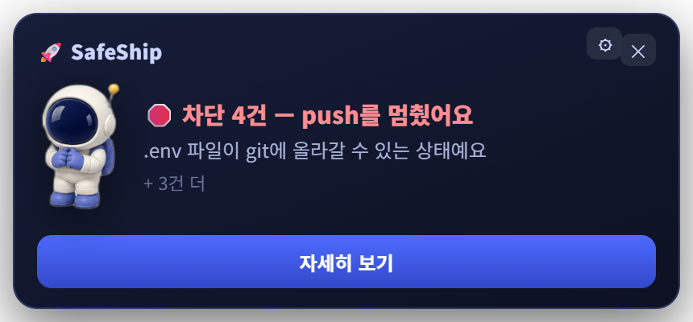
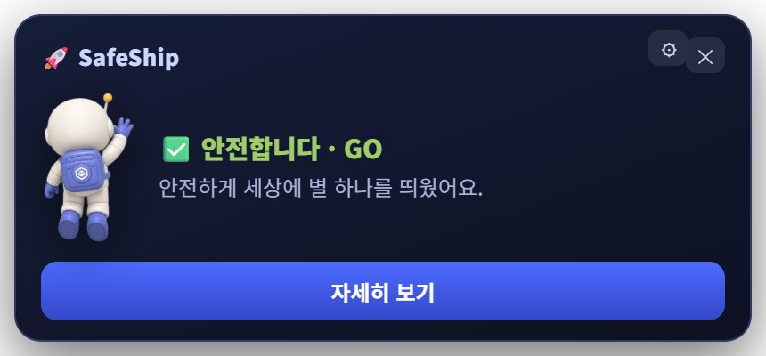

# 🚀 SafeShip

> **`git push` 하기 직전, 사고를 막아주는 안전벨트.**
> 시크릿 유출 · 배포 실패 · 요금 폭주를 자동으로 잡아냅니다.

<p align="center">
  
</p>

---

## 왜 만들었나

AI로 빠르게 만드는 건 쉬워졌는데, **올리는 순간이 무섭습니다.**

- `.env`를 그대로 커밋해서 **API 키가 GitHub에 공개**되고
- `NEXT_PUBLIC_` 접두사 하나 때문에 **서버 키가 모든 방문자 브라우저에 실려 나가고**
- 지출 상한을 안 걸어둬서 **자고 일어나니 요금 200만원**

이런 사고는 대부분 **push 직전 10초만 확인했으면** 막을 수 있는 것들입니다.
SafeShip은 그 10초를 자동으로 대신해 주고, 문제가 있으면 **push를 멈춰 세웁니다.**

시작은 **아이들에게 AI로 만드는 걸 가르치고 싶은데, 모르고 배포했다가 사고가 날까 봐**였습니다.
그래서 경고를 무섭게 하지 않았습니다 — 관제사 NOVA가 옆에서 알려주는 방식으로,
겁주지 않으면서 "지금 이건 위험해요"를 알아들을 수 있게 만들었습니다.

## 30초 시작

```bash
# 내 프로젝트에서 한 번만 (pre-push 훅이 설치됩니다)
npx github:cool0720zzz/safeship init
```

끝. 이제 `git push` 할 때마다 자동으로 점검합니다.

```bash
git push
#  ✅ 안전(GO)     → 조용히 통과 + 관제탑에서 발사 → 별 축하
#  🛑 차단(NO-GO)  → push를 멈추고 무엇이 문제인지 브리핑
#                    (급할 땐 git push --no-verify 로 우회)
```

훅 없이 그때그때 확인만 하고 싶다면:

```bash
npx github:cool0720zzz/safeship scan .          # 터미널 리포트
npx github:cool0720zzz/safeship scan . --web    # 함선 관제탑 UI
```

## 실제로 이렇게 잡힙니다

```
$ git push origin main

🛑 SafeShip: 차단 2건 — 푸시를 멈췄어요

Git 안전 · 시크릿
  ■ 차단  .env 파일이 git에 올라갈 수 있는 상태예요
          .env — 이미 git에 추적 중이라 .gitignore만으로는 보호되지 않아요.
                 git rm --cached로 추적을 끊고, 안의 키는 재발급하세요. · 약 30초

배포 전 점검
  ■ 차단  서버용 키가 브라우저에 노출될 이름이에요
          .env:2 — NEXT_PUBLIC_OPENAI_API_KEY. 이 접두사가 붙으면
                   사이트 방문자 누구나 값을 볼 수 있어요. · 약 2분

비용 · 요금 사고 방지
  ▲ 확인  OpenAI 지출 상한(프로젝트 예산)을 설정했는지 확인하세요
          조직 예산은 알림만 오고 멈추지 않아요. Project별 Budget만 실제로 중단시켜요.

발사 관제 판정: NO-GO — 차단 2건
error: failed to push some refs
```

각 항목마다 **"AI로 고치기"** 프롬프트가 함께 나옵니다. 그대로 복사해 AI에게 붙여넣으면 고치는 법을 안내받아요. (시크릿 실제 값은 **절대 포함되지 않습니다** — 앞 6자만 마스킹)

## 무엇을 점검하나 — 3기둥

| 기둥 | 잡아내는 것 |
|---|---|
| 🔐 **Git 안전 · 시크릿** | `.env`·개인키·`.npmrc` 커밋, 하드코딩된 API 키(27종 패턴), **base64로 감춘 자격증명**, 예시 파일에 실수로 넣은 진짜 키, 이미 추적 중이라 `.gitignore`가 무력한 파일, 대용량 파일, main 직접 작업 |
| 🚢 **배포 프리플라이트** | `NEXT_PUBLIC_`/`VITE_` 키 노출, **프로덕션 디버그 모드**(`DEBUG=True`, `APP_DEBUG`), 개발 서버로 배포, `0.0.0.0:$PORT` 바인딩, 락파일·런타임 버전 누락, SPA 딥링크 404, 마이그레이션 단계 누락, Firebase 규칙 전체 공개, Supabase RLS, `.dockerignore`·docker-compose 평문 시크릿 |
| 💸 **비용 가드** | **"예산 알림 ≠ 지출 상한"** — 실제로 멈추는 설정 안내(18개 서비스), rate limit 부재, 고가 모델 기본값, `service_role` 키 노출, 무료 티어 함정(슬립·크레딧 소진·SSR 과금) |

## 어떤 스택에서 되나

- **언어**: JavaScript/TypeScript · Python · Ruby · PHP · Go · 정적 사이트
- **프레임워크**: Next.js · Vite · CRA · Astro · SvelteKit · Nuxt · Remix · Express · **Django · Flask · FastAPI · Rails · Laravel**
- **배포**: Vercel · Netlify · Cloudflare · Render · Railway · Fly.io · Heroku · Firebase · Supabase · AWS Amplify · GitHub Pages · Docker

스택을 자동 감지해서 **그 스택에 맞는 체크리스트만** 적용합니다. (Next.js면 Vercel 체크, Django면 `DEBUG`·`ALLOWED_HOSTS` 체크)

## 두 가지 모드 — 배우는 사람과 익숙한 사람

같은 점검 결과를 **두 가지 인터페이스**로 보여줍니다.

| | 전체 UI (기본) | 미니 UI |
|---|---|---|
| 언제 | 처음 배울 때, 아이들과 함께 볼 때 | 익숙해진 뒤 일상 작업 |
| 모양 | 화면 오른쪽 1/3, 함선을 구역별로 둘러보며 브리핑 | 작업표시줄 위 우하단에 톡 뜨는 작은 카드 |
| 통과(GO)했을 때 | 발사 → 별이 되는 축하 연출 | 짧게 알리고 6초 뒤 알아서 사라짐 |

| 미니 — 차단 | 미니 — 통과 |
|---|---|
|  |  |
| 가장 급한 문제 한 줄 + 나머지 건수 | 알리고 스스로 사라짐 |

미니에서 **"자세히 보기"** 를 누르면 그 자리에서 전체 UI로 펼쳐집니다.

### 바꾸는 법 — 앱 안에서 (설정 파일 안 건드려도 됩니다)

관제탑 오른쪽 아래(미니에서는 카드 헤더)의 **⚙ 버튼**을 누르면 표시 방식을 고를 수 있습니다.

- 고르는 즉시 **지금 창에도 바로 적용**되고
- 동시에 **기본값으로 저장**돼서 다음 push부터 그 모양으로 뜹니다

터미널에서 바꾸고 싶다면:

```bash
safeship config ui mini      # 기본을 미니로
safeship config ui full      # 기본을 전체 화면으로
safeship config              # 지금 설정 확인
safeship scan . --ui mini    # 저장하지 않고 이번만
```

설정은 홈 폴더의 `~/.safeship.json`에 저장됩니다. 특정 프로젝트만 다르게 하려면 그 프로젝트 루트에 `.safeship.json`을 두면 그쪽이 우선합니다.

```json
{ "ui": "mini" }
```

## 화면

관제사 **NOVA**가 함선(= 당신의 레포)을 구역별로 점검하며 브리핑합니다.

| 스캔 브리핑 | NO-GO 판정 |
|---|---|
|  |  |
| 부위별로 짚어가며 무엇이 문제인지 설명 + AI로 고치기 | 차단 목록과 판정, 해결 전엔 발사 잠김 |

| 시작 화면 | GO — 발사 → 별 |
|---|---|
|  |  |
| 스크롤하며 스캔 시작 | 안전하게 통과하면 로켓이 날아가 **별**이 됩니다 |

> 문제가 없으면 사고 연출도 나오지 않습니다 — 초록불 구역은 NOVA도 평온해요.

## 어떻게 동작하나

```
git push
   ↓
pre-push 훅이 가로챔
   ↓
레포 스캔 (스택 감지 → 해당 룰만 실행)
   ↓
┌── GO  ──→ 조용히 통과, push 진행 + 축하 연출
└── NO-GO ─→ 터미널 리포트 + 관제탑 표시 + push 차단(exit 1)
```

관제탑은 **브라우저 패널**(주소창 없는 크롬리스 창, 화면 오른쪽 1/3에 도킹)로 뜹니다.
[네이티브 데스크톱 앱](desktop/)을 설치하면 **화면 오른쪽에서 스르륵 밀려 들어오는 오버레이**로 바뀝니다.

## 명령어

| 명령 | 설명 |
|---|---|
| `safeship init` | 현재 레포에 pre-push 훅 설치 |
| `safeship scan [폴더]` | 스캔 후 터미널 리포트 (GO면 exit 0, NO-GO면 1) |
| `safeship scan . --web` | 함선 관제탑 UI를 브라우저 패널로 |
| `safeship scan . --ui mini` | 작업표시줄 위 미니 카드로 (기본은 `full`) |
| `safeship config ui <full\|mini>` | 기본 표시 방식 저장 (앱의 ⚙ 버튼과 같은 설정) |
| `safeship scan . --json` | 결과를 JSON으로 (CI 연동용) |

## 프로젝트 구조

```
packages/core   @safeship/core — 스캔 엔진 (탐지기 + 3기둥 룰 + AI 고치기 프롬프트)
packages/cli    safeship CLI (scan / init / --web)
desktop/        Tauri v2 네이티브 오버레이 앱
samples/        데모 픽스처 (일부러 문제를 심어둔 레포들)
research/       룰 데이터의 출처 리서치 6편
webui/          함선 관제탑 UI
```

## 설계 원칙

- **시크릿 실제 값은 절대 노출하지 않음** — 리포트에도, AI 프롬프트에도 (앞 6자만 마스킹)
- **"예산 알림 ≠ 지출 상한"** — 알림만 오고 안 멈추는 설정과, 진짜 멈추는 설정을 구분해서 안내
- **표준 용어 유지** — 브랜치·커밋 같은 용어는 그대로 쓰되, 어려운 단어엔 호버 설명
- **레포로 확인 불가한 건 정직하게** — 계정 대시보드 설정 등은 "확인해주세요"로 체크 요청

## 상태

M0–M3(스캔 엔진·CLI·룰 레지스트리) + 데스크톱 오버레이(C0–C2) 완료. **개발 중**입니다.
자세한 기획은 [SafeShip_기획서.md](SafeShip_기획서.md)를 참고하세요.

## 라이선스

MIT
